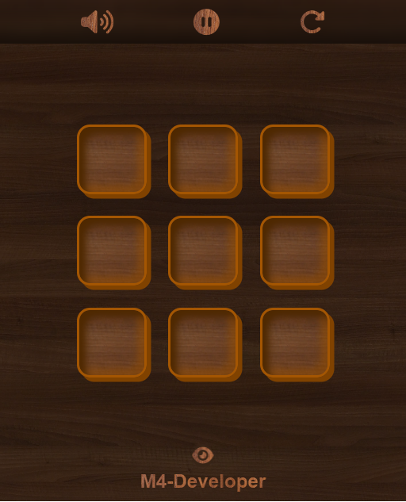
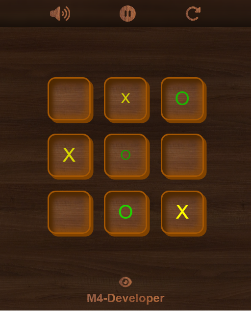
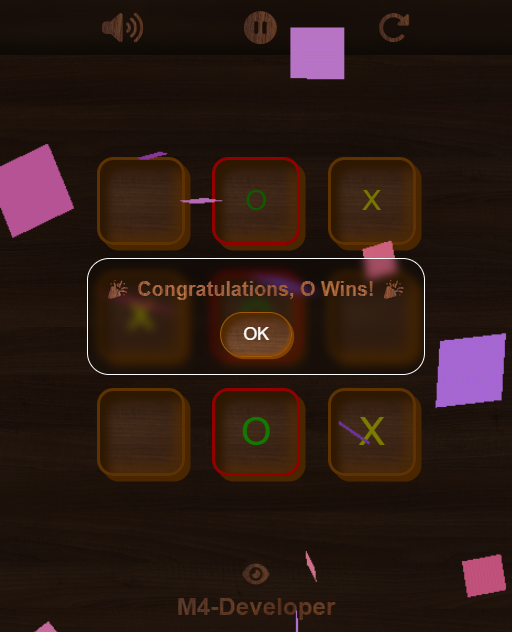
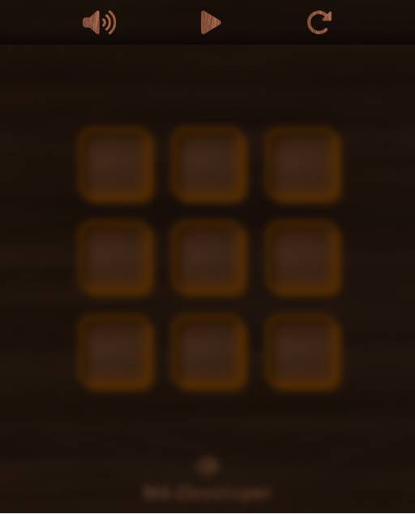

# Tic Tac Toe - Two Player Game

This is a **Tic Tac Toe** game designed for two players with a classic wooden-themed design. The project includes interactive buttons to control sound, pause, and reset functionalities, along with a dynamic win popup to announce the winner.

## Table of Contents

- [Features](#features)
- [Screenshots](#screenshots)
- [Setup](#setup)
- [How to Play](#how-to-play)
- [Project Structure](#project-structure)
- [Technologies Used](#technologies-used)
- [Future Improvements](#future-improvements)
- [Credits](#credits)

---

## Features

- **Two Player Mode**: Play with another player in a classic tic-tac-toe match.
- **Win Popup**: Shows a congratulatory popup for the winner.
- **Game Controls**:
  - **Sound On/Off**: Toggle game sounds.
  - **Pause**: Pause the game to take a break.
  - **Restart**: Start a new game at any time.
- **Responsive Design**: Optimized for desktop and mobile screens.
- **Themed Design**: Wooden theme for a unique, rustic feel.

---

## Screenshots



| Feature        | Screenshot                                    |
| -------------- | --------------------------------------------- |
| **Game Board** |  |

| **Win Popup** |  |
| **Pause Screen** |  |

> **Note:** You may need to create the `screenshots` folder and add appropriate images.

---

## Setup

To run this project locally:

1. **Clone the repository**:

   ```bash
   git clone https://github.com/Mohibbulla-MMM/tik-tak-to-mohibbullah.git
   ```

2. **Open `index.html` in a browser**:
   Simply open the `index.html` file in any modern web browser.

---

## How to Play

1. **Start the Game**: The first player begins by clicking on an empty cell.
2. **Take Turns**: Players alternate turns by marking `X` and `O` in the cells.
3. **Win Condition**: The first player to align three symbols vertically, horizontally, or diagonally wins!
4. **Restart**: Click the **restart button** anytime to reset the game.
5. **Sound & Pause Controls**: Use the sound button to toggle sound and the pause button to take a break.

---

## Project Structure

```bash
Tic-Tac-Toe-Two-Player/
├── assests/
│   ├── css/
│   │   ├── bubble.css       # CSS for bubbles in the pause screen
│   │   ├── footer.css       # Footer styling
│   │   ├── header.css       # Header styling
│   │   └── winpopup.css     # Styles for the win popup
│   └── js/
│       ├── header.js        # Controls for the header (sound, pause, restart)
│       └── winPopUp.js      # Script for handling the win popup
├── index.html               # Main HTML structure
├── style.css                # General styling for the game board
└── script.js                # Core game logic
```
